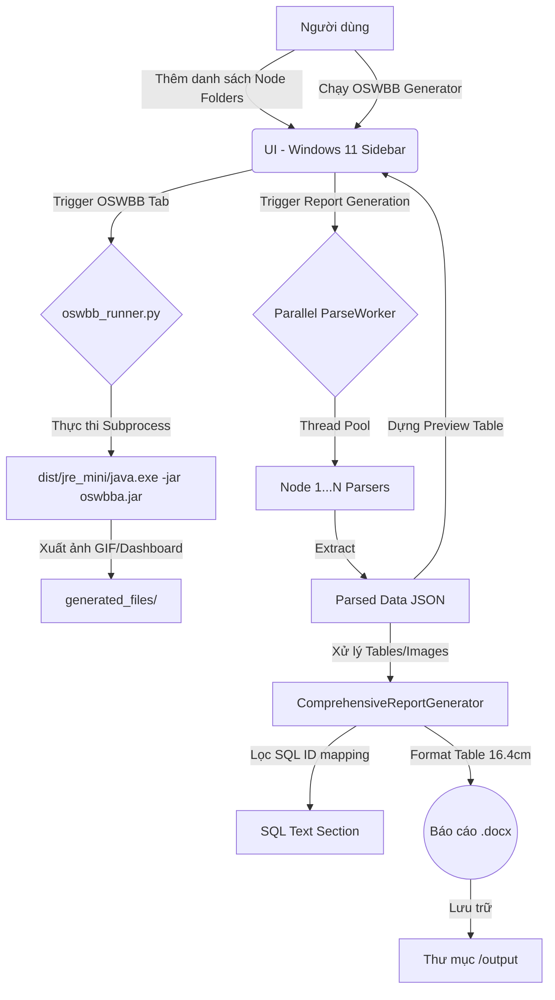

# PROJECT_MAP

## Tổng quan Functional
Ứng dụng **Oracle Report Generator** là một Desktop App (viết bằng Python/PyQt5) dùng để tự động phân tích và trích xuất dữ liệu từ các file log của hệ thống Oracle Database RAC hỗ trợ đa nút (N-Node, N >= 1).
Ứng dụng hỗ trợ:
- Phân tích song song (Parallel Parsing) AWR Reports, Alert Logs và System Information.
- Tích hợp **OSWBB (Oracle Solaris OS Watcher Black Box)** với khả năng Sync đa thư mục mục tiêu.
- Xuất báo cáo Health Check chuẩn hóa Word (`.docx`) với định dạng bảng biểu cố định 16.4cm.
- Giao diện **Windows 11 Fluent Design** thanh lịch, hiện đại.

## Cấu trúc File/Thư mục hiện có
```text
d:/VSCode/NewApplication/
├── main.py                    # Entry point chính của ứng dụng
├── build_onefile.spec         # Cấu hình PyInstaller (Đóng gói JRE, QSS, Icon)
├── PROJECT_MAP.md              # Sơ đồ dự án và tài liệu hệ thống
├── README.md                  # Hướng dẫn sử dụng
│
├── oswbb/                     # Chứa oswbba.jar và các script tiện ích OSWBB
├── styles/                    # Giao diện Windows 11 Fluent
│   ├── main.qss               # File định dạng CSS cho Qt (QSS)
│   └── icon.ico               # Biểu tượng đã fix padding (256x256)
│
├── scripts/                   # Các script tự động hóa quy trình
│   ├── create_jre_mini.bat    # Đóng gói JRE 8 tối giản đi kèm App
│   └── build_app.bat          # Script build executable tự động
│
├── dist/                      # Thư mục đầu ra của PyInstaller
│   ├── jre_mini/              # JRE 8 được copy vào để đóng gói
│   └── OracleReportGenerator.exe # File chạy duy nhất (Standalone)
│
└── src/                       # Source code chính
    ├── config.py              # Các hằng số cấu hình (App Name, Version, Path)
    ├── parsers/               # Các engine phân tích dữ liệu log
    ├── generators/            # Engine tạo báo cáo DOCX (N-Node dynamic logic)
    ├── ui/                    # Giao diện chính (MainWindow, Sidebar, Stacked Pages)
    └── utils/                 # Các tiện ích hệ thống
        ├── oswbb_runner.py    # Wrapper điều khiển Java thực thi OSWBB
        ├── logger.py          # Central logging system
        └── helpers.py         # Xử lý chuỗi, đường dẫn, sanitize
```

---

## Sơ đồ luồng dữ liệu (Data Flow)


---

## Thống kê Tham Số Đặt Cứng (Hard-coded Values)

### 1. `src/config.py` & `main.py`
- `APP_NAME` = "Oracle Report Generator"
- `APP_VERSION` = "2.0.1"
- `AppUserModelID` = "victorle.oracle.reportgen.2.0.1" (Fix Taskbar Icon)
- `WINDOW_WIDTH` = 1440
- `WINDOW_HEIGHT` = 900

### 2. `styles/main.qss` (Win 11 Style)
- `Background`: `#F3F3F3`
- `Surface`: `#FFFFFF`
- `Accent Color`: `#0067C0` (Windows Blue)
- `Font`: `'Segoe UI Variable Display', 'Segoe UI'`
- `Corner Radius`: 8px (Cards), 4px (Buttons)

### 3. `src/generators/comprehensive_report_generator.py`
- Kích thước bảng cố định: `Cm(16.4)`
- Độ rộng cột Table 1.9.2: `[3.5, 7.0, 3.25, 2.65] cm`
- Độ rộng cột Table 1.3.4 (Top SQL): `[1.9, 1.5, 2.25, 1.25, 1.25, 1.25, 3.0, 4.0] cm`
- Pattern lọc rác NULL: `["NULL NULL", "NULL | 0", "NULL 0", "NULL  0"]`
- Connection logic: Tự động map SQL ID giữa mục 1.3.4 và 1.3.5.

### 4. `src/utils/oswbb_runner.py`
- Default Fallback: `java` (nếu không có `jre_mini`)
- JAR location: `oswbb/oswbba.jar` hoặc `_MEIPASS/oswbb`.
